## 1. 产品概述

个人投资组合管理与财经资讯APP，面向个人投资者提供一站式证券账户管理、智能投顾、行情监控、技术分析、模拟交易和会员服务的综合金融服务平台。帮助用户科学配置资产、实时掌握市场动态、验证投资策略，实现财富的稳健增值。

## 2. 核心功能

### 2.1 用户角色

| 角色 | 注册方式 | 核心权限 |
|------|----------|----------|
| 普通用户 | 手机号/邮箱注册 | 绑定账户、查看行情、模拟交易、基础报告 |
| 会员用户 | 付费升级 | 免佣金、专属研报、优先客服、高级策略 |
| 管理员 | 后台登录 | 用户管理、数据看板、广告配置、内容推荐 |

### 2.2 功能模块

1. **仪表盘首页**: 资产总览、收益概览、快捷操作、市场热点
2. **账户管理**: 证券账户绑定、持仓同步、交易记录、现金余额
3. **智能投顾**: 风险测评、资产配置模型、调仓推荐、操作建议
4. **行情中心**: 自选股行情、实时价格、财经新闻、异动提醒、涨跌幅预警
5. **技术分析**: K线图、MACD、RSI、均线叠加、参数自定义
6. **模拟交易**: 虚拟账户、策略回测、收益率、夏普比率、最大回撤、对比报告
7. **会员中心**: 等级体系、权益展示、续费提醒、交易统计
8. **管理后台**: 用户统计、资产总值、活跃度、广告点击率、时间筛选
9. **报告中心**: 月度投资报告、盈亏明细、资产配置、收费明细、导出功能
10. **市场预测**: 热门板块、风格轮动、推荐策略、广告智能匹配

### 2.3 页面详情

| 页面名称 | 模块名称 | 功能描述 |
|----------|----------|----------|
| 仪表盘首页 | 资产总览卡片 | 显示总资产、今日收益、累计收益率、持仓数量 |
| 仪表盘首页 | 收益趋势图 | 近30天收益走势折线图，支持时间范围切换 |
| 仪表盘首页 | 资产配置饼图 | 股票/债券/现金/基金占比环形图 |
| 仪表盘首页 | 市场热点轮播 | 热门板块、涨幅排行、重要资讯滚动展示 |
| 仪表盘首页 | 快捷操作区 | 调仓建议、预警通知、快速交易入口 |
| 账户管理 | 账户列表 | 已绑定证券账户卡片，显示账户名称、券商、资产余额 |
| 账户管理 | 绑定账户表单 | 券商选择、账号输入、密码验证、授权确认 |
| 账户管理 | 持仓明细 | 股票代码、名称、持仓数量、成本价、现价、盈亏比例 |
| 账户管理 | 交易记录 | 买卖时间、股票、价格、数量、手续费、成交金额 |
| 智能投顾 | 风险测评问卷 | 10道选择题测评风险偏好，生成风险等级 |
| 智能投顾 | 配置模型选择 | 股债平衡、行业轮动、稳健增值、激进成长四种模型 |
| 智能投顾 | 调仓推荐列表 | 建议买入/卖出的股票、建议仓位、预期收益 |
| 智能投顾 | 一键调仓 | 预览调仓方案、确认执行、操作结果反馈 |
| 行情中心 | 自选股列表 | 股票代码、名称、现价、涨跌幅、成交量、预警状态 |
| 行情中心 | 添加自选股 | 搜索股票代码/名称、批量添加、分组管理 |
| 行情中心 | 预警设置 | 涨跌幅阈值、价格上下限、通知方式（站内/短信/邮件） |
| 行情中心 | 财经新闻列表 | 分类标签、新闻标题、来源、发布时间、热度标记 |
| 行情中心 | 个股异动提醒 | 异常波动弹窗、原因分析、相关新闻链接 |
| 技术分析 | K线图主区域 | 日K/周K/月K切换、成交量柱图、复权设置 |
| 技术分析 | 指标面板 | MACD、RSI、KDJ、BOLL指标切换与参数设置 |
| 技术分析 | 均线设置 | MA5/MA10/MA20/MA60自定义显示、颜色配置 |
| 技术分析 | 画线工具 | 趋势线、黄金分割、斐波那契回撤 |
| 模拟交易 | 虚拟账户概览 | 初始资金、当前净值、持仓市值、可用资金 |
| 模拟交易 | 策略回测 | 选择策略、设置时间区间、回测执行、进度显示 |
| 模拟交易 | 回测结果报告 | 收益率曲线、夏普比率、最大回撤、胜率、盈亏比 |
| 模拟交易 | 对比报告 | 多策略对比、基准指数对比、柱状图/表格展示 |
| 模拟交易 | 交易下单 | 股票搜索、买入/卖出、价格类型（限价/市价）、数量 |
| 会员中心 | 会员等级展示 | 青铜/白银/黄金/铂金/钻石等级卡片，当前等级高亮 |
| 会员中心 | 权益清单 | 免佣金次数、专属研报份数、优先客服、高级策略权限 |
| 会员中心 | 升级规则说明 | 月均交易额达标自动升级、等级权益对比表 |
| 会员中心 | 续费提醒 | 到期前7天弹窗提醒、续费按钮、价格方案 |
| 管理后台 | 数据概览看板 | 注册用户数、绑定资产总值、模拟交易活跃度、广告点击率 |
| 管理后台 | 趋势图表 | 按日/周/月统计折线图、柱状图、同比环比数据 |
| 管理后台 | 时间筛选器 | 自定义时间范围、快捷选项（今日/本周/本月/本季度） |
| 管理后台 | 用户管理 | 用户列表、搜索、禁用/启用、查看详情 |
| 报告中心 | 月度报告列表 | 报告月份、生成状态、下载按钮 |
| 报告中心 | 报告详情预览 | 账户盈亏明细表格、资产配置饼图、收费明细 |
| 报告中心 | 导出功能 | PDF/Excel格式导出、批量导出、邮件发送 |
| 市场预测 | 热门板块推荐 | 板块名称、预测热度、相关个股、置信度 |
| 市场预测 | 风格轮动分析 | 价值/成长/周期/防守风格评分、切换建议 |
| 市场预测 | 策略推荐 | 基于当前市场环境推荐的投资策略与理由 |

## 3. 核心流程

### 3.1 主业务流程描述

用户注册登录后，首先绑定证券账户，系统自动同步持仓和交易记录。完成风险测评后，智能投顾模块根据风险偏好推荐资产配置方案和调仓建议。用户可在行情中心查看自选股实时行情，设置涨跌幅预警，浏览财经新闻。通过技术分析模块进行K线和指标分析。在模拟交易模块创建虚拟账户进行策略回测，验证投资策略的收益率、夏普比率和最大回撤。会员根据月均交易额自动升级，享受免佣金、专属研报等权益。管理员通过后台看板实时监控平台运营数据。系统基于历史行情和宏观数据预测热门板块和风格轮动，智能调整推荐内容和广告策略。每月自动生成投资报告，支持导出PDF/Excel。

```mermaid
flowchart TD
    A["用户注册/登录"] --> B["绑定证券账户"]
    B --> C["同步持仓与交易记录"]
    C --> D["完成风险测评"]
    D --> E["智能投顾推荐配置方案"]
    E --> F["查看调仓建议并执行"]
    F --> G["行情中心监控自选股"]
    G --> H["涨跌幅预警触发"]
    G --> I["技术分析K线指标"]
    F --> J["模拟交易策略回测"]
    J --> K["生成回测报告（收益率/夏普/回撤）"]
    F --> L["会员等级自动升级"]
    L --> M["享受专属权益"]
    N["管理员"] --> O["数据看板监控"]
    O --> P["市场预测与广告调整"]
    Q["月度报告自动生成"] --> R["导出PDF/Excel"]
```

## 4. 用户界面设计

### 4.1 设计风格

- **主色调**: 深邃藏青 (#0F172A) 作为主背景色，搭配金融金 (#D4AF37) 作为品牌色，翡翠绿 (#10B981) 表示上涨，珊瑚红 (#EF4444) 表示下跌
- **辅助色**: 科技蓝 (#3B82F6) 用于链接和按钮，中性灰 (#64748B) 用于次要文字
- **按钮风格**: 圆角8px，渐变背景，悬停时微妙放大和阴影加深，按下时有凹陷反馈
- **字体**: 标题使用 "Noto Serif SC" 宋体体现专业金融感，正文使用 "Inter" 保证可读性，数字使用 "JetBrains Mono" 等宽字体
- **布局风格**: 卡片式布局，玻璃拟态效果（backdrop-blur），深色主题配合微光边框
- **图标风格**: Lucide React 线性图标，统一1.5px线宽，金融金高光
- **动效**: 数字滚动动画、卡片悬浮微抬升、图表渐入绘制、预警脉冲闪烁

### 4.2 页面设计概述

| 页面名称 | 模块名称 | UI元素 |
|----------|----------|--------|
| 仪表盘首页 | 资产总览卡片 | 深色玻璃卡片、金色边框光晕、数字滚动动画、红绿涨跌色 |
| 仪表盘首页 | 收益趋势图 | 渐变填充面积图、十字准星、时间轴滑动选择器 |
| 仪表盘首页 | 资产配置饼图 | 环形图、中心显示总资产、图例悬停高亮对应扇区 |
| 账户管理 | 账户列表 | 券商Logo卡片、余额大字号、绑定状态标签、解绑按钮 |
| 智能投顾 | 风险测评 | 进度条、卡片式选项、选择后平滑过渡下一题、结果雷达图 |
| 智能投顾 | 调仓推荐 | 列表行、买入绿箭头、卖出红箭头、建议仓位进度条、一键执行按钮 |
| 行情中心 | 自选股列表 | 表格行、涨跌色背景、预警铃铛图标闪烁、右滑删除手势 |
| 行情中心 | 预警设置 | 滑块控件、阈值输入框、通知方式开关组、测试通知按钮 |
| 技术分析 | K线图主区域 | 黑色背景、红绿K线、十字光标、右侧价格刻度、底部成交量 |
| 技术分析 | 指标面板 | Tab切换、参数输入表单、颜色选择器、重置按钮 |
| 模拟交易 | 回测结果 | 收益率曲线对比图、关键指标卡片（夏普/回撤/胜率）、交易明细表格 |
| 会员中心 | 等级展示 | 垂直阶梯布局、当前等级聚光效果、权益勾选图标、进度条显示距下一等级 |
| 管理后台 | 数据看板 | 4宫格指标卡片、趋势折线图、时间范围选择器、数据刷新按钮 |
| 报告中心 | 报告预览 | 仿A4纸白色背景、页眉Logo、分页表格、导出浮动按钮 |

### 4.3 响应式

- **Desktop-first** 设计，主内容区最小宽度1280px
- 侧边导航在平板端折叠为图标模式，移动端变为底部Tab栏
- 图表组件使用ECharts响应式配置，自动适应容器宽度
- 表格在小屏幕下转为卡片列表展示
- 触摸优化：所有可点击元素最小44x44px，支持下拉刷新、横向滑动

### 4.4 视觉氛围

- 整体采用深色金融科技风格，搭配微光粒子背景动画
- 关键数据使用金色渐变文字，营造高端专业感
- 涨跌数字使用动态发光效果（上涨绿光、下跌红光）
- 卡片边缘1px微光边框，悬浮时阴影扩散
- 页面切换使用淡入+轻微位移动画，时长300ms
