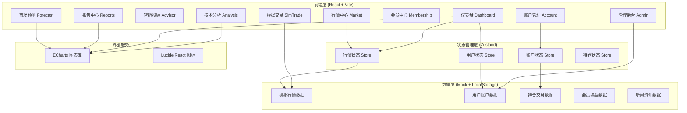
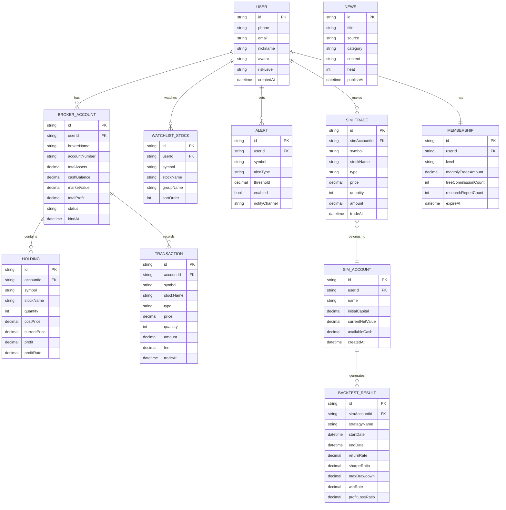

## 1. 架构设计



## 2. 技术说明

- **前端框架**: React@18 + TypeScript
- **构建工具**: Vite@5
- **样式方案**: TailwindCSS@3
- **状态管理**: Zustand@4
- **路由方案**: React Router DOM@6
- **图表库**: ECharts@5 + echarts-for-react
- **图标库**: Lucide React
- **后端服务**: 无后端，纯前端 Mock 数据 + LocalStorage 持久化
- **数据存储**: LocalStorage 存储用户配置、自选股、模拟交易数据

## 3. 路由定义

| 路由路径 | 页面组件 | 用途 |
|----------|----------|------|
| / | Dashboard | 仪表盘首页 - 资产总览、收益概览、市场热点 |
| /accounts | AccountList | 账户管理 - 证券账户列表、绑定新账户 |
| /accounts/:id | AccountDetail | 账户详情 - 持仓明细、交易记录、现金余额 |
| /advisor | RiskAssessment | 智能投顾 - 风险测评入口、配置模型 |
| /advisor/recommend | PortfolioRecommend | 调仓推荐 - 智能调仓方案、一键执行 |
| /market | MarketWatch | 行情中心 - 自选股列表、实时行情、预警 |
| /market/news | NewsList | 财经新闻 - 资讯列表、分类筛选 |
| /analysis/:symbol | TechnicalAnalysis | 技术分析 - K线图、MACD、RSI、均线 |
| /simulation | SimAccount | 模拟交易 - 虚拟账户概览、下单交易 |
| /simulation/backtest | StrategyBacktest | 策略回测 - 回测配置、结果报告 |
| /membership | MembershipCenter | 会员中心 - 等级展示、权益清单、续费 |
| /admin | AdminDashboard | 管理后台 - 数据看板、用户统计 |
| /reports | ReportList | 报告中心 - 月度报告列表、导出功能 |
| /reports/:month | ReportDetail | 报告详情 - 盈亏明细、资产配置预览 |
| /forecast | MarketForecast | 市场预测 - 热门板块、风格轮动分析 |

## 4. 数据模型

### 4.1 数据模型定义



### 4.2 核心数据类型定义

```typescript
// 用户类型
interface User {
  id: string;
  phone: string;
  email: string;
  nickname: string;
  avatar: string;
  riskLevel: 'conservative' | 'steady' | 'balanced' | 'aggressive' | 'radical';
  createdAt: string;
}

// 证券账户类型
interface BrokerAccount {
  id: string;
  userId: string;
  brokerName: string;
  accountNumber: string;
  totalAssets: number;
  cashBalance: number;
  marketValue: number;
  totalProfit: number;
  status: 'active' | 'inactive' | 'syncing';
  bindAt: string;
}

// 持仓类型
interface Holding {
  id: string;
  accountId: string;
  symbol: string;
  stockName: string;
  quantity: number;
  costPrice: number;
  currentPrice: number;
  profit: number;
  profitRate: number;
}

// 交易记录类型
interface Transaction {
  id: string;
  accountId: string;
  symbol: string;
  stockName: string;
  type: 'buy' | 'sell';
  price: number;
  quantity: number;
  amount: number;
  fee: number;
  tradeAt: string;
}

// 实时行情类型
interface StockQuote {
  symbol: string;
  name: string;
  price: number;
  change: number;
  changePercent: number;
  open: number;
  high: number;
  low: number;
  volume: number;
  amount: number;
  turnover: number;
  pe: number;
  pb: number;
}

// K线数据类型
interface KLineData {
  time: string;
  open: number;
  close: number;
  high: number;
  low: number;
  volume: number;
  macd?: number;
  dif?: number;
  dea?: number;
  rsi?: number;
  kdj_k?: number;
  kdj_d?: number;
  kdj_j?: number;
  ma5?: number;
  ma10?: number;
  ma20?: number;
  ma60?: number;
}

// 会员类型
interface Membership {
  id: string;
  userId: string;
  level: 'bronze' | 'silver' | 'gold' | 'platinum' | 'diamond';
  monthlyTradeAmount: number;
  freeCommissionCount: number;
  researchReportCount: number;
  expireAt: string;
}

// 模拟账户类型
interface SimAccount {
  id: string;
  userId: string;
  name: string;
  initialCapital: number;
  currentNetValue: number;
  availableCash: number;
  createdAt: string;
}

// 回测结果类型
interface BacktestResult {
  id: string;
  simAccountId: string;
  strategyName: string;
  startDate: string;
  endDate: string;
  returnRate: number;
  sharpeRatio: number;
  maxDrawdown: number;
  winRate: number;
  profitLossRatio: number;
  equityCurve: { date: string; value: number }[];
}

// 新闻类型
interface News {
  id: string;
  title: string;
  source: string;
  category: 'macro' | 'industry' | 'stock' | 'policy';
  content: string;
  heat: number;
  publishAt: string;
}

// 管理后台统计类型
interface AdminStats {
  totalUsers: number;
  activeUsers: number;
  totalAssets: number;
  simTradeCount: number;
  adClickRate: number;
  dailyTrend: { date: string; users: number; assets: number }[];
}
```

## 5. 项目目录结构

```
d:\trae-bz\TraeProjects\12370/
├── .trae/documents/          # 项目文档
│   ├── prd.md
│   └── technical-architecture.md
├── src/
│   ├── components/           # 通用组件
│   │   ├── layout/           # 布局组件（Sidebar、Header、PageContainer）
│   │   ├── charts/           # 图表组件（K线图、折线图、饼图）
│   │   ├── cards/            # 卡片组件（资产卡片、股票卡片）
│   │   ├── forms/            # 表单组件
│   │   └── common/           # 通用UI（Button、Modal、Table、Badge）
│   ├── pages/                # 页面组件
│   │   ├── Dashboard/
│   │   ├── Accounts/
│   │   ├── Advisor/
│   │   ├── Market/
│   │   ├── Analysis/
│   │   ├── Simulation/
│   │   ├── Membership/
│   │   ├── Admin/
│   │   ├── Reports/
│   │   └── Forecast/
│   ├── stores/               # Zustand状态管理
│   │   ├── userStore.ts
│   │   ├── accountStore.ts
│   │   ├── marketStore.ts
│   │   └── simulationStore.ts
│   ├── mock/                 # Mock数据
│   │   ├── users.ts
│   │   ├── accounts.ts
│   │   ├── holdings.ts
│   │   ├── quotes.ts
│   │   ├── kline.ts
│   │   ├── news.ts
│   │   └── membership.ts
│   ├── utils/                # 工具函数
│   │   ├── format.ts         # 数字/货币/日期格式化
│   │   ├── calculator.ts     # 收益率/夏普比率/最大回撤计算
│   │   ├── indicators.ts     # 技术指标计算（MACD、RSI、MA）
│   │   └── storage.ts        # LocalStorage封装
│   ├── types/                # TypeScript类型定义
│   │   └── index.ts
│   ├── hooks/                # 自定义Hooks
│   │   ├── useQuote.ts       # 行情订阅Hook
│   │   └── useMember.ts      # 会员权益Hook
│   ├── assets/               # 静态资源
│   │   └── styles/
│   │       └── globals.css
│   ├── App.tsx
│   ├── main.tsx
│   └── router.tsx
├── public/
├── package.json
├── tsconfig.json
├── vite.config.ts
├── tailwind.config.js
└── postcss.config.js
```
